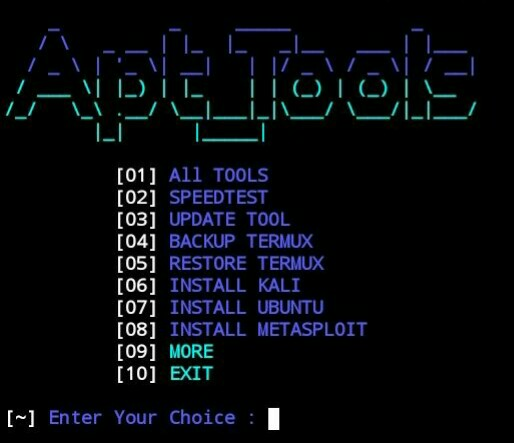
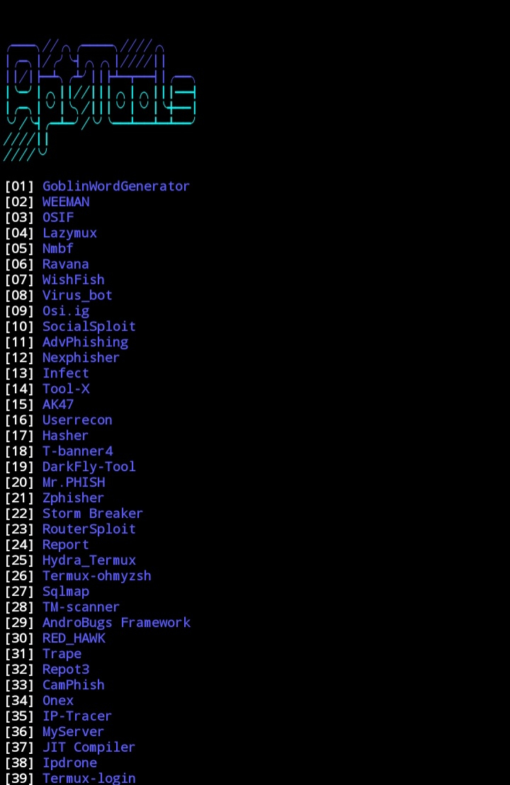

# Apt_Tools

## AVAILABLE ON :
   
   > `Termux`

## TESTED ON :

   > `Termux`

## REQUIREMENTS :
  
   > `storage 500MB`
   > `python`
   > `git`
   > `ruby`
   > `figlet`
   > `lolcat`
   > `internet`
## Installation Termux

      apt update && apt upgrade -y
      apt install git python -y
      git clone https://github.com/DilumBBandara/Apt_Tools.git
      cd Apt_Tools
      python setup.py
      python apt_tools.py

## SCREEN SHOTS :

